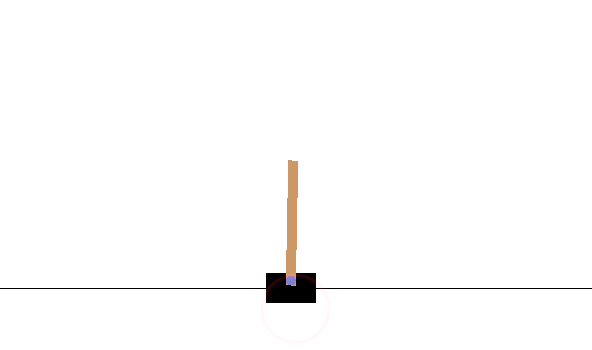
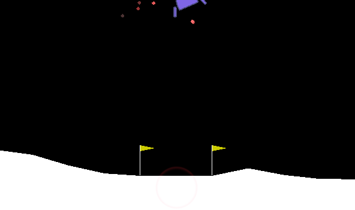

# Exercises in Deep Reinforcement Learning

This project inludes several exercises applying variations of deep reinforcement learning on OpenAI Gym environments.

### Deep Q-Networks

In Q-learning, given a state, each action possible from that state is assigned a Q-value that indicates the potential value of taking that action from the state; these Q-values are learned over time using a method such as temporal difference learning (see [basic Q-learning project](https://github.com/iamshang1/Projects/tree/master/Basic_ML/Reinforcement_Learning)). In traditional Q-learning, the Q-values for every possible state are stored in a table, which is intractable for problems with large state/action spaces. In deep Q-learning, each state is represented as a set of input features, and the Q-values for each possible action are then calculated using a neural network; this eliminates the need to store the Q-values for every possible state/actions in memory.

On their own, DQNs will always choose the action with the highest Q-value. If the DQN starts with a suboptimal policy, the DQN may end up consistently choosing suboptimal actions and never explore and learn better actions. Therefore, DQNs generally utilize an explore/exploit schedule -- the network will begin by choosing random actions, and over time the network switches over to choosing actions with the highest Q-value.

An additional common property of DQNs is the use of a replay memory. Because the observations from any one episode are highly correlated, training repeatedly on the most recent observations can cause the DQN to overfit. Therefore, we save the *X* most recent observations into a replay memory and sample randomly from the replay memory to create training batches.

### Double Deep Q-Networks

Deep Q-learning networks are generally trained using temporal difference learning. As a result, basic DQNs can be difficult to train because the target Q-values used for training are calculated using the same network that is being trained. In other words, each update made to the network directly effects the calculations of the target Q-values used for the following update,  so the network is always chasing a moving target. One way to mitigate this is to use two networks in parallel -- a fast network and a slow network. The fast network is updated at every step using the target Q-values calculated by the slow network, which is updated once every *X* steps by copying over the parameters from the fast network.

### Dueling Deep Q-Networks

A potential inefficiency of DQNs is that the network must learn an independent Q-value for each possible action. For problems with large action spaces, this means that the network must explore all possible actions before it will learn the appropriate Q-values for each action. One way to mitigate this is to separate the calculation of the value of each state from the calculation of the relative advantage of each action; the final Q-value is then calculated as the value of the state plus the relative advantage of the selected action. Therefore, the network will know something about the Q-value of an action (based off the value of the state) even if it has not fully explored that action.

### Policy Networks

Instead of trying to calculate the Q-values associated with each action for a given state, we can build a network to predict the best action directly. Given an input state, policy networks generate a softmax probability distribution over all possible actions from that state -- the desired action can then be sampled from that distribution. Compared to DQNs, policy networks are more stable during training, i.e., significant changes in the agent's policy for selection actions are less likely. In addition, because policy networks sample actions from a probability distribution rather than always choosing the action with the highest Q-value, there is no need for an explore/exploit schedule. One downside of policy networks is that they are more likely than DQNs to get trapped in local optima.

Whereas the DQN-based approaches make an update every step in the episode, our policy network trains only once at the end of each episode. In addition, our policy network does not utilize a replay memory; instead, each training batch is simply composed of the observations from latest episode.

### Actor-Critic Networks

Policy networks are trained using the REINFORCE algorithm, which pushes the network to choose actions that give the highest future payout. This requires us to know the future payouts associated with each state/action ahead of time. Instead, we can use a neural network to estimate the expected future payouts for a given state and action, similar to in DQNs. An actor-critic network does exactly this using two neural networks -- an actor network and a critic network. The actor network is simply a policy network similar to that described above. The critic network estimates the future payout from a given state, similar to in a DQN, and is used to train the policy network.

Like our policy network, our actor-critic trains once per episode using the observations from that episode. This is inefficient, because the network must wait for a full episode to complete before each update. The training speed of our actor-critic could be greatly improved by utilizing multiple threads (asynchronous actor critic) -- certain threads may be dedicated to running episodes to generate batches of training observations, and the remaining threads can be used to update the network parameters at a faster pace.

### Notes on Running Code

 - **cartpole_dqn.py** trains in about 350 episodes (including burn-in), with small chance of failure to converge
 - **lander_dddqn.py** trains in about 500 episodes (including burn-in)
 - **lander_policy.py** trains in roughly 3000-5000 episodes, but requires far fewer updates than lander_dddqn.py because only one update is made per episode
 - **lander_ac2.py** trains in roughly 2000-3000 episodes, but requires far fewer updates than lander_dddqn.py because only one update is made per episode